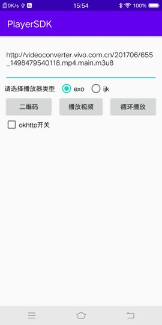
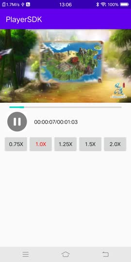
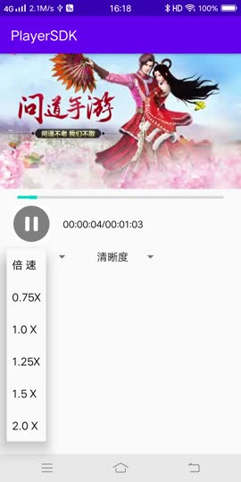

# PlayerSDK
提供一个高效的播放器库，播放相关的优化和功能都会在这个项目中完成

#### 目前支持的功能
> * 支持ijkplayer 和 exoplayer 两种播放器
> * 支持进度条和seek功能
> * 支持二维码扫描网址功能
> * 支持循环播放的功能
> * 支持倍速的功能
> * 支持针对HLS Master视频的切换清晰度功能

#### 版本更新日志
##### 2.0.0
```
repositories {
    maven { url 'https://jitpack.io' }
}

implementation 'com.github.JeffMony:PlayerSDK:2.0.0'
```

#### 切换清晰度的接入
```
VideoInfoParserManager.getInstance().parseVideoInfo(mUrl, mVideoInfoCallback);

public interface IVideoInfoCallback {
  void onVideoType(String contentType, String name);
  void onMutipleVideo(List<M3U8Seg> urlList);
  void onFailed(Exception e);
}
```
在onMutipleVideo(List<M3U8Seg> urlList)回调函数中会出现呈现的几个清晰度的片源

#### PlayerSDK接入文档
```
CommonPlayer mPlayer = new CommonPlayer(Context, PlayerType);
mPlayer.setLooping(mIsLooping);
mPlayer.setSurface(mSurface);
mPlayer.setOnPreparedListener(mPrepareListener);
mPlayer.setOnVideoSizeChangedListener(mSizeChangedListener);
mPlayer.prepareAsync();
```

设置接口层是IPlayer.java
```java
public interface IPlayer {

    void setDataSource(Context context, Uri uri)
            throws IOException, IllegalArgumentException, SecurityException, IllegalStateException;

    void setDataSource(String path)
            throws IOException, IllegalArgumentException, SecurityException, IllegalStateException;

    void setDataSource(Context context, Uri uri, Map<String, String> headers)
            throws IOException, IllegalArgumentException, SecurityException, IllegalStateException;

    void setDataSource(FileDescriptor fd)
            throws IOException, IllegalArgumentException, IllegalStateException;

    void setDataSource(FileDescriptor fd, long offset, long length)
            throws IOException, IllegalArgumentException, SecurityException, IllegalStateException;

    void setSurface(Surface surface);

    void prepareAsync() throws IllegalStateException;

    void start() throws IllegalStateException;

    void stop() throws IllegalStateException;

    void pause() throws IllegalStateException;

    void setSpeed(float speed);

    void release();

    void seekTo(long msec) throws IllegalStateException;

    void setLooping(boolean isLooping);

    boolean isLooping();

    long getCurrentPosition();

    long getDuration();

    boolean isPlaying();

    void setOnPreparedListener(OnPreparedListener listener);

    void setOnVideoSizeChangedListener(
            OnVideoSizeChangedListener listener);

    void setOnErrorListener(OnErrorListener listener);

    interface OnPreparedListener {
        void onPrepared(IPlayer mp);
    }

    interface OnVideoSizeChangedListener {
        void onVideoSizeChanged(IPlayer mp, int width, int height,
                                int rotationDegree,
                                float pixelRatio,
                                float darRatio);
    }

    interface OnErrorListener {
        void onError(IPlayer mp, int what, String msg);
    }
}
```

#### demo示意图


欢迎关注我的公众号JeffMony，我会持续为你带来音视频---算法---Android---python 方面的知识分享<br>

